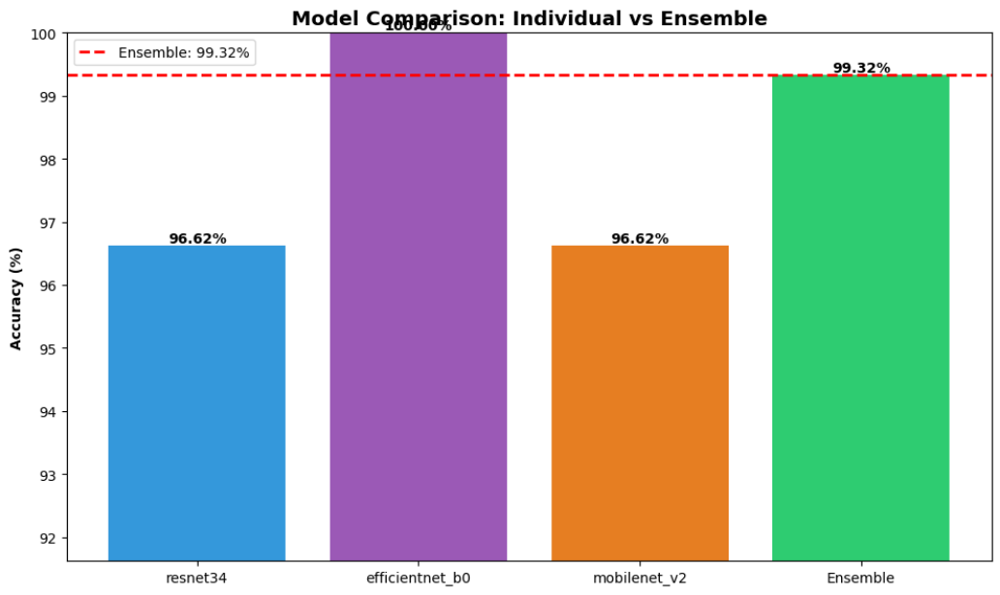

# ai-receipt-classifier-ensemble

This project implements a hybrid machine learning pipeline to detect whether a digital receipt screenshot is real (human-generated) or AI-generated. The notebook extracts features from receipts using pretrained CNNs (ResNet34, EfficientNet-B0, MobileNetV2), trains XGBoost classifiers on these features, and combines their predictions via soft-voting for accurate classification. It also includes evaluation metrics and a single-image inference block for testing new receipts.

 

 

## Tech Stack

- Python, PyTorch, torchvision, PIL
- XGBoost, scikit-learn, NumPy
- Matplotlib, Seaborn for visualization
- Google Colab for GPU acceleration

## Features

- Uses pretrained CNNs (ResNet34, EfficientNet-B0, MobileNetV2) to extract image features
- Trains XGBoost classifiers on CNN features
- Combines predictions via soft-voting ensemble for robust classification
- Can test single images or batches for real vs AI receipts

### Notes

Works best on structured receipts; unseen formats may require retraining

Can be extended with data augmentation or additional feature extractors
